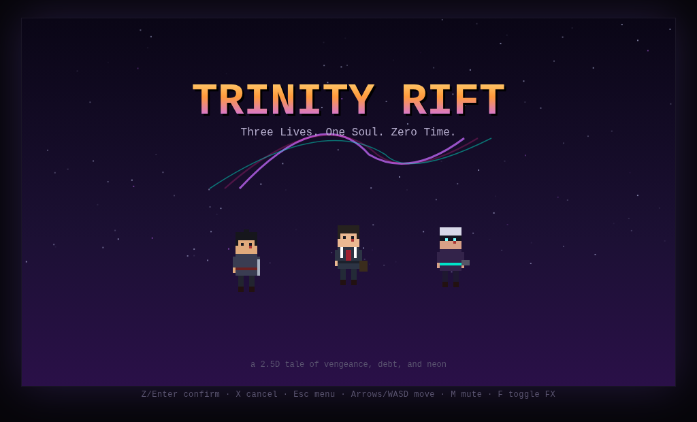
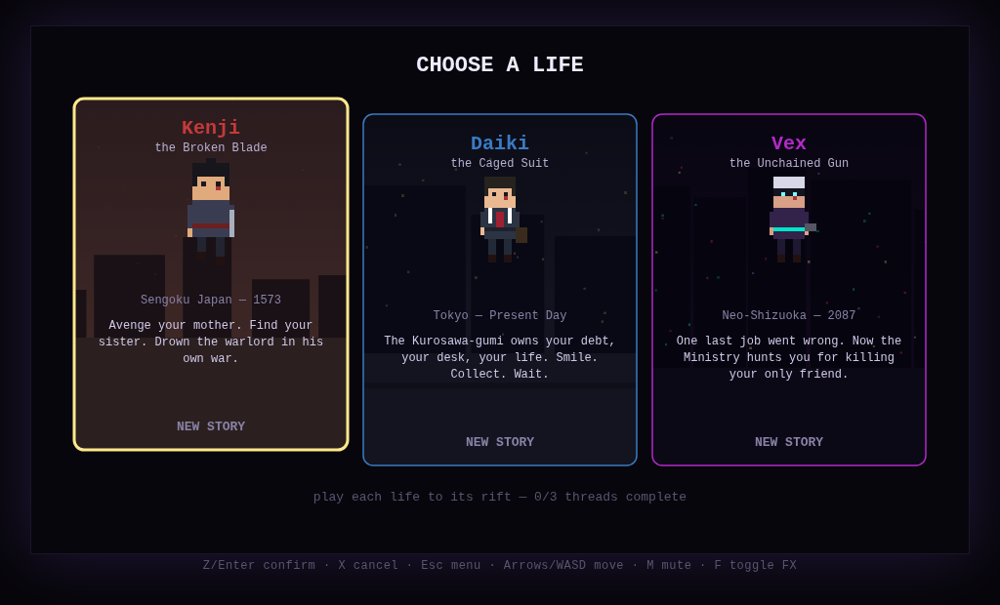
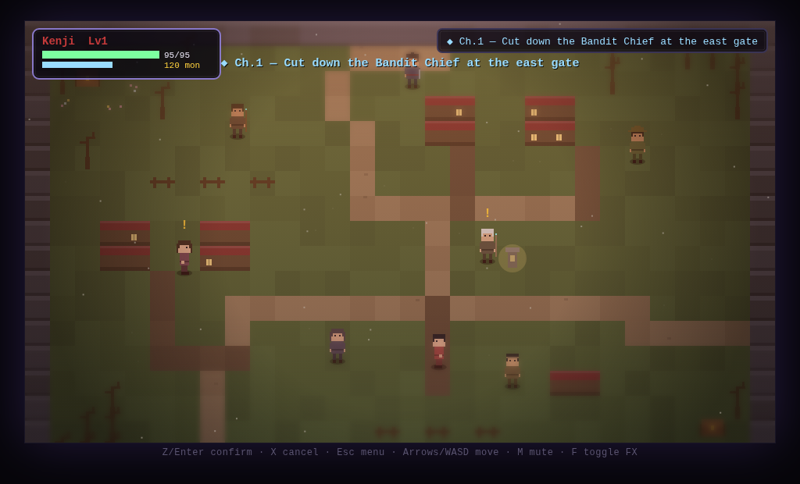
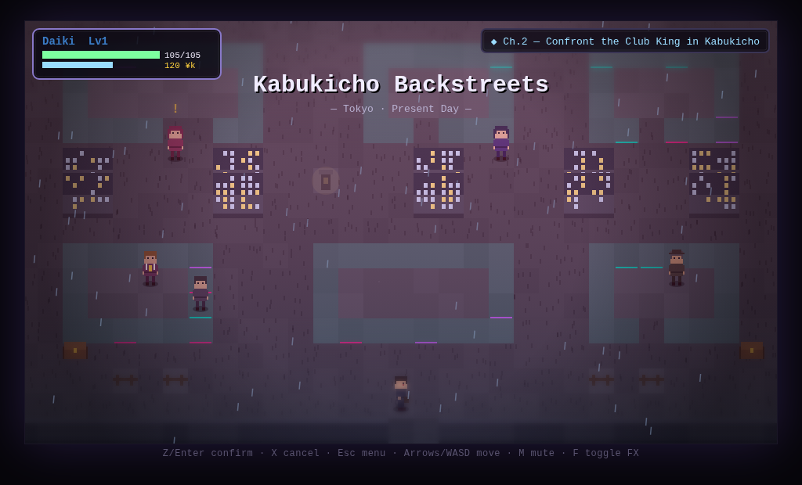
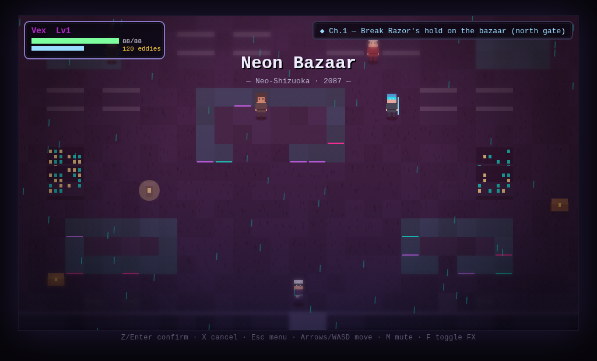
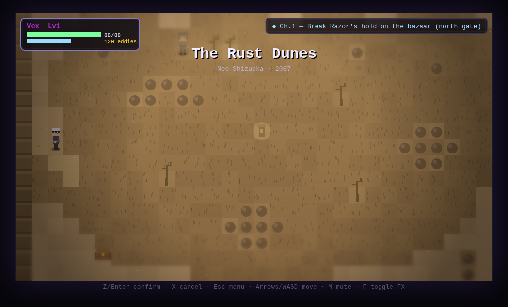
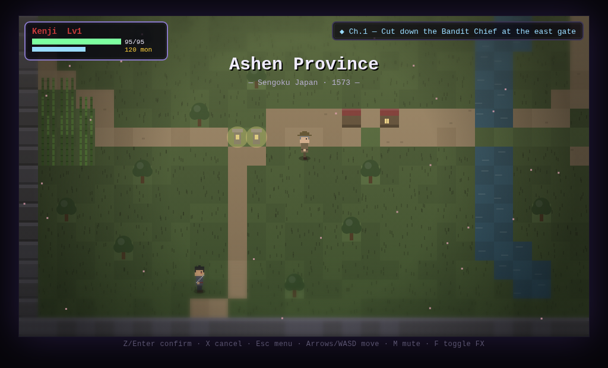
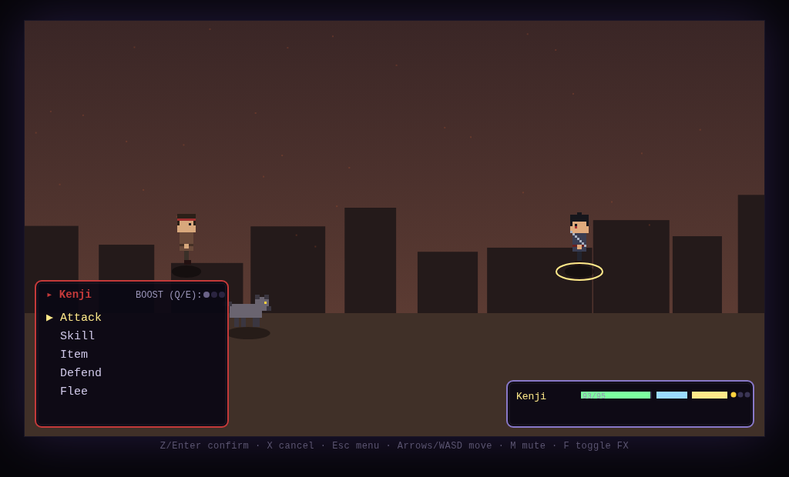
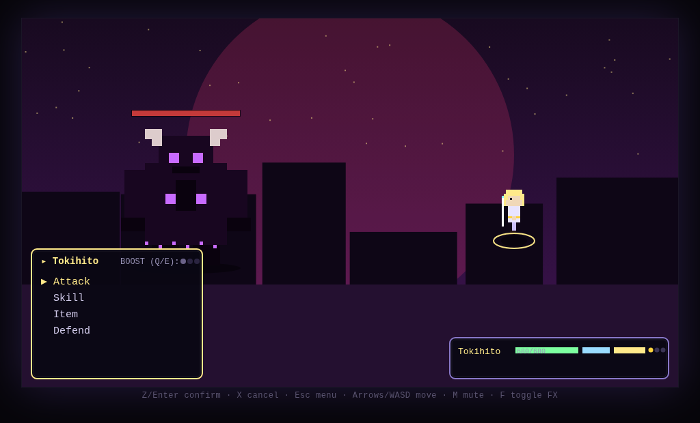

# TRINITY RIFT

**Three Lives. One Soul. Zero Time.** — a 2.5D HD-2D-style RPG in the spirit of *Octopath Traveler*,
with punchy real-time round-based (ATB) combat in the spirit of *FFVII*. Built entirely in
vanilla JavaScript + Canvas: every sprite, tile, backdrop, music track and sound effect is
generated procedurally in code. No external assets, no build step, no dependencies.



## ▶ How to play

Open `index.html` in any modern browser (Chrome/Edge/Firefox). That's it.
If your browser blocks `file://` pages, serve the folder instead: `python3 -m http.server` → `http://localhost:8000`.

| Key | Action |
|-----|--------|
| Arrows / WASD | Move |
| Z / Enter / Space | Confirm · Interact · Advance dialogue |
| X / Backspace | Cancel |
| Esc | Pause menu (Status · Items · Equip · Party · Quests · System/Save) |
| Q / E | Spend Boost Points in battle (up to 3) |
| Shift | Run (raises encounter rate!) |
| M | Mute music · **F** toggle HD-2D post-FX |

Progress saves at glowing **shrines** (they also heal and set your respawn checkpoint) and
from the System menu.

## Three lives, one soul

Choose a life on the character select screen. Play each story to its cliffhanger — a **time
rift** — and when all three threads are cut loose, **THE CONVERGENCE** unlocks: the three
men battle each other in mirror duels, learn they are one time-traveler split into three
timelines by the demon god **Kuroyami**, unify into the divine **Tokihito**, and take the
fight to the Hour Between Hours.

| | | |
|---|---|---|
|  |  |  |
|  |  |  |

- **KENJI — Sengoku Japan, 1573** *(dark, bloody revenge tale)*: his mother murdered and his
  sister taken, a ronin climbs the warlord's chain of command — bandit chief, blade-master,
  castle captain, war oni, and Lord Masakado himself — through ash villages, whispering
  bamboo, a castle town, a corpse-marsh and a mountain keep.
- **DAIKI — Tokyo, present day**: a CFO discovers the Fourth Ledger and is sold to the
  Kurosawa-gumi. He pretends to play along — and audits the entire yakuza from the inside.
  Office district, Kabukicho neon, corporate towers, Chiba countryside, midnight docks.
- **VEX — Neo-Shizuoka, 2087**: a hired gun takes one contract too many and kills his only
  friend — a senator in disguise. Hunted by the Ministry, he fights to broadcast the truth.
  Neon bazaar, rust-desert dunes, arcology plaza, undercity tunnels, government citadel.

## Features

- **HD-2D presentation**: pixel sprites over painted-light scenes — tilt-shift depth-of-field,
  per-world color grading, bloom on neon worlds, vignette, and biome particles (falling ash,
  sakura petals, rain, neon rain, dust, void motes). Toggle with **F**.
- **ATB combat** (active mode — gauges keep filling): Attack / Skills / Items / Defend / Flee,
  hit-stop, screen shake, crits, damage pop-ups, boss rage-phases with dialogue barks, and a
  3-pip **Boost** system that multiplies attacks and skills.
- **Equipment**: per-world weapons, armor and charms — found in **chests**, dropped by
  **enemies**, or bought in **shops** (buy/sell). Distinct hero skill books unlock by level.
- **Semi-open worlds**: each timeline has an explorable overworld connecting **5 areas**,
  gated by story chapters, with random encounters on wild terrain.
- **NPCs & quests**: dialogue with portraits, side quests (kill / collect / find) with a
  quest log and turn-in rewards, lore NPCs, signs, shops and inns/shrines.
- **Companions**: hire up to **2 followers** from five personality archetypes — **brute,
  tactician, thief, gambler, tech-genius** — each with unique combat abilities *and* its own
  ambient dialogue bank (overworld chatter, battle-start and victory barks). Nine hireable
  characters across the three worlds.
- **The Convergence**: scripted mirror duels between the three protagonists, the truth,
  divine unification, and a two-phase demon-god finale with credits.




## Project structure

```
index.html            entry point (script load order matters)
css/style.css
js/
  core.js             globals, RNG, save/load, scene & transition plumbing
  input.js            keyboard mapping
  audio.js            procedural WebAudio music sequencer + SFX synth
  sprites.js          parameterized pixel-art generators (humanoid/beast/blob/mech/demon)
  tiles.js            tile renderer, map baking, battle backdrops, ambience presets
  items.js            item catalog, inventory, equipment, stats & leveling
  dialog.js           dialogue boxes, choices, cutscene runner
  quest.js            side-quest state machine
  map.js              map parsing & collision
  combat.js           ATB battle system (boost, statuses, AI, rewards)
  ui.js               pause menu, shop, HUD
  world.js            overworld scene + HD-2D post-FX pipeline
  scenes.js           title, character select, credits
  main.js             boot + game loop
data/
  common.js           companion personality dialogue banks
  world_samurai.js    world 1: enemies, bosses, companions, shops, quests, cutscenes, 6 maps
  world_business.js   world 2: same structure
  world_cyber.js      world 3: same structure
  convergence.js      finale: echoes, Kuroyami, rift nexus map, ending & credits
tools/validate.js     content validator (node tools/validate.js)
```

### Extending content

Everything is data-driven and registered through `G.register*` calls. To add an area:
write an ASCII map (`tiles.js` documents the legend — `#` wall, `T` tree, `~` water,
`,` hostile grass, `+` shrine, `B` hi-rise …), register NPCs/chests/exits/triggers on it,
and run `node tools/validate.js` — it checks walkability, reachability from spawn,
broken references, and exit bounce-loops.

## Dev notes

- Tested headlessly with Playwright (title → select → story intro → overworld → menus →
  shop → battle → convergence → final boss) with zero console errors.
- `tools/validate.js` gates content correctness; run it after any map/data change.
- Save data lives in `localStorage` (`trinity_rift_v1`). Erase from the title screen (X twice).
